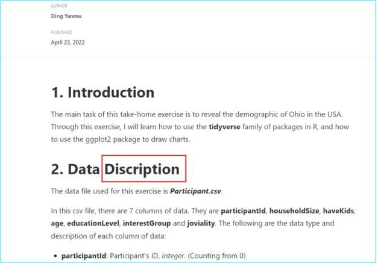

```{r setup, include=FALSE}
knitr::opts_chunk$set(echo = TRUE,
                      eval = TRUE,
                      warning = FALSE,
                      message = FALSE)
```

# Overview

In this take-home exercise, I will critic [Ding Yanmu](https://dingyanmu.netlify.app/th_ex/th_ex1.html)'s Take-home Exercise 1 submission in terms of clarity and aesthetics. I will also remake the original design by applying the data visualisation principles and best practice we had learnt in Lesson 1 and 2.

# Getting Started

We will first install and launch the required R packages using the code chunk below.

```{r}
packages = c('tidyverse', 'ggdist', 'ggridges', 'patchwork', 'ggthemes', 'ggrepel')

for(p in packages){
  if(!require(p, character.only = T)){
    install.packages(p)
  }
  library(p, character.only = T)
}
```

We will also import the *Participants.csv* from the data folder into R using the code chunk below.

```{r}
participants <- read_csv("data/Participants.csv")

glimpse(participants)
```

# Critic 1
- Original Design



- Critic

There is a typo with the title as shown in the picture above. This affects the overall aesthetics of the article.

- Makeover

Should be corrected as below:

**2. Data Description**


# Critic 2
- Original Design


- Critic

The orientation of the *age_group* label on the x-axis can be challenging to read. This coincides with one of the **data-ink** principles on graph labeling where the orientation of label should be reader friendly.

- Makeover

We will group the data using the code chunk below

```{r}
participants$age_group <- cut(participants$age,
                                  breaks = c(-Inf,21, 26, 31, 36, 41, 46, 51, 56, Inf),
                                  labels = c("<20", "21-25", "26-30","31-35", "36-40", 
                                             "41-45", "46-50","51-55", "56-60"),
                                  right = FALSE)
```

The code chunk below plots a bar chart by using `geom_bar()` of **ggplot2**, withe use of `coord_flip()` to correct the orientation of the label.

```{r}
ggplot(data = participants,
       aes(x=age_group)) +
  geom_bar() +
  coord_flip() +
  geom_text(stat="count", aes(label=paste0(..count..)), check_overlap=TRUE, colour="blue", fontface="bold", 
            position=position_stack(vjust = 1.04)) +
  xlab("Age Group") +
  ylab("No. of Participants") +
  ggtitle("Age Distribution")

```

```{r}
ggplot(data = participants,
       aes(x=age_group, y=joviality, color=haveKids, group = haveKids)) +
  stat_summary(fun.y=mean, geom = "point") +
  stat_summary(fun.y=mean, geom = "line") +
  stat_summary(aes(label = round(..y.., 2)), fun.y=mean, geom = "label_repel", segment.size = 0) +
  scale_y_continuous(expand = c(0, 0), limits = c(0, 1)) +
  xlab("Age Group") +
  ylab("Joviality") +
  ggtitle("Joviality across Age Groups by Kids Status")

```

```{r fig.height = 6, fig.width = 10}
ggplot(data = participants,
       aes(x=age_group, y=joviality, color=educationLevel, group = educationLevel)) +
  stat_summary(fun.y=mean, geom = "point") +
  stat_summary(fun.y=mean, geom = "line") +
  scale_y_continuous(expand = c(0, 0), limits = c(0, 1)) +
  xlab("Age Group") +
  ylab("Joviality") +
  ggtitle("Joviality across Age Groups by Education Level")

```

```{r echo = FALSE}
p1 <- ggplot(data = participants,
       aes(x=age_group)) +
  geom_bar() +
  coord_flip() +
  geom_text(stat="count", aes(label=paste0(..count..)), check_overlap=TRUE, colour="blue", fontface="bold", 
            position=position_stack(vjust = 1.04)) +
  xlab("Age Group") +
  ylab("No. of Participants") +
  ggtitle("Age Distribution")

p2 <- ggplot(data = participants,
       aes(x=age_group, y=joviality, color=haveKids, group = haveKids)) +
  stat_summary(fun.y=mean, geom = "point") +
  stat_summary(fun.y=mean, geom = "line") +
  stat_summary(aes(label = round(..y.., 2)), fun.y=mean, geom = "label_repel", segment.size = 0) +
  scale_y_continuous(expand = c(0, 0), limits = c(0, 1)) +
  xlab("Age Group") +
  ylab("Joviality") +
  ggtitle("Joviality across Age Groups by Kids Status")

p3 <- ggplot(data = participants,
       aes(x=age_group, y=joviality, color=educationLevel, group = educationLevel)) +
  stat_summary(fun.y=mean, geom = "point") +
  stat_summary(fun.y=mean, geom = "line") +
  scale_y_continuous(expand = c(0, 0), limits = c(0, 1)) +
  xlab("Age Group") +
  ylab("Joviality") +
  ggtitle("Joviality across Age Groups by Education Level")
```

```{r fig.height = 16, fig.width = 16}
patchwork <- ((p1 | p2)/ p3) + 
              plot_annotation(tag_levels = 'I', title = 'Demographic of the city of Engagement, Ohio USA')
patchwork & theme_economist()
```