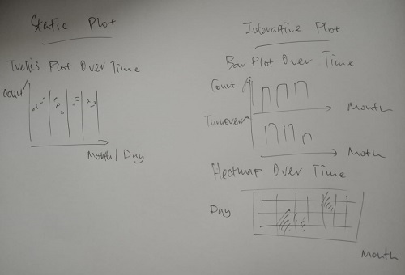

```{r setup, include=FALSE}
knitr::opts_chunk$set(echo = TRUE,
                      eval = TRUE,
                      warning = FALSE,
                      message = FALSE,
                      fig.retina = 3)
```


# Task

**Challenge 3: Economic** considers the financial health of the city. Over time, are businesses growing or shrinking? How are people changing jobs? Are standards of living improving or declining over time?

Consider the financial status of Engagement’s businesses and residents, and use visual analytic techniques to address these questions.

- Describe the health of the various employers within the city limits. What employment patterns do you observe? Do you notice any areas of particularly high or low turnover? Limit your response to 10 images and 500 words.

# Overview

In this take-home exercise, appropriate static and interactive statistical graphics methods are used to reveal the economic of the [city of Engagement, Ohio USA](https://vast-challenge.github.io/2022/) while addressing the questions stated in the Task section.

The data are processed by using appropriate **tidyverse** family of packages and the statistical graphics are prepared using **ggplot2** and its extensions.

# Sketch of Proposed Design

The picture below shows a sketch of the initial design proposed. 




# Installing & Launching R Packages

Before we get started, it is important for us to ensure that the required R packages have been installed. If yes, we will load the R packages. If they have yet to be installed, we will install the R packages and load them onto R environment.

The chunk code below will do the trick.

```{r}
packages = c('tidyverse', 'ggdist', 'ggridges', 'patchwork', 'ggthemes', 'lubridate', 'ggiraph', 'gganimate', 'plotly', 'DT', 'crosstalk')

for(p in packages){
  if(!require(p, character.only = T)){
    install.packages(p)
  }
  library(p, character.only = T)
}

library(trelliscopejs)
```

# Importing Data

The code chunk below imports *TravelJournal.csv* and *Employers.csv* from the data folder into R by using [`read_csv()`](https://readr.tidyverse.org/reference/read_delim.html) of [**readr**](https://readr.tidyverse.org/) package and save them as tibble data frames called *travel* and *employers*.

```{r}
travel <- read_csv("rawdata/TravelJournal.csv")
employers <- read_csv("rawdata/Employers.csv")

summary(travel)
summary(employers)
```


# Data Wrangling

Some of the new time-related fields have been added to *travel* with the following code chunk:

```{r}
travel$year_month <- format(as.Date(travel$`travelEndTime`), "%Y-%m")
travel$day <- day(travel$`travelEndTime`)
travel$wkday <- weekdays(travel$`travelEndTime`)
```

Data frames *travel* and *employers* are saved in RDS format to avoid uploading large files to Git.

```{r}
saveRDS(travel, 'data/travel.rds')
saveRDS(employers, 'data/employers.rds')
```

```{r}
travel <- readRDS('data/travel.rds')
employers <- readRDS('data/employers.rds')
```


# Static Histogram for Overview

We will first examine the overall trend of participants' travels for various purpose in *travel*.

```{r}
ggplot(data=travel, 
       aes(x = travelStartTime, 
           fill = purpose)) +
    geom_histogram(bins=15,
                   color="black") +
    scale_y_continuous(NULL,
                     breaks = NULL) +
    labs(y= 'Travel Count', x= 'Time',
       title = "Travel Trend by Purpose Over Time") +
    theme(axis.title.y= element_text(angle=0), axis.ticks.x= element_blank(),
        axis.line= element_line(color= 'grey'))
```

# Static Trellis Plot

We have transformed the data accordingly and displayed a trellis plot partitioned by purpose in order to look at travel trend for respective purpose.

```{r echo = FALSE}
travel_count <- travel %>%
  select(year_month, purpose, participantId) %>%
  group_by(year_month, purpose) %>%
  summarise(count = n()) %>%
  ungroup()
```

```{r}
qplot(year_month, count, data = travel_count) +
  facet_wrap(~ purpose) +
  labs(y= 'Travel Count', x= 'Time',
     title = "Travel Trend for Respective Purpose Over Time") +
  theme(axis.title.y= element_text(angle=0), axis.ticks.x= element_blank(), axis.text.x=element_blank(),
      axis.line= element_line(color= 'grey'))
```

# Further Data Wrangling - Work

We will zoom into work travel patterns and both *travel* and *employers* are joined using `inner_join()` function of **dplyr**.

```{r}
travel_to_work <- travel %>%
  filter(purpose == 'Work/Home Commute') %>%
  inner_join(y=employers, by = c("travelEndLocationId" = "employerId")) %>%
  select(participantId, travelEndTime, year_month, day, wkday, travelEndLocationId, purpose, location, buildingId) %>%
  rename('employerId' = 'travelEndLocationId')
```


Renaming has been performed simplicity using the code chunk below:

```{r}
travel_to_work$purpose <- sub('Work/Home Commute', 
                              'Work',
                              travel_to_work$purpose)
```


# Static Trellis Plot - Line

We will now look at daily trend of work travel patterns for each month.

```{r echo=FALSE}
travel_to_work_count <- travel_to_work %>%
  group_by(year_month, day) %>%
  summarise(count = n()) %>%
  ungroup()
```

```{r fig.width=12, fig.height=4}
ggplot() + 
  geom_line(data=travel_to_work_count,
            aes(x=day, 
                y=count, 
                group=year_month), 
            colour="black") +
  facet_grid(~year_month) +
  labs(y= 'Travel \nCount', x= 'Month/Day',
     title = "Daily Travel Trend across Month") +
  theme(axis.title.y= element_text(angle=0),
      axis.line= element_line(color= 'grey'))
```


# Static Trellis Plot - Dot

Due to the cluttered-ness of the previous plot, we will aim to improve the display using a trellis dot plot.

```{r}
qplot(day, count, data = travel_to_work_count) +
  facet_wrap(~ year_month) + 
  labs(y= 'Travel \nCount', x= 'Month/Day',
     title = "Daily Travel Trend across Month") +
  theme(axis.title.y= element_text(angle=0), axis.text.x=element_blank(), axis.ticks.x=element_blank(),
      axis.line= element_line(color= 'grey'))

```

# Static Trellis Plot - Dot 2

Since the facet function of **ggplot2** is not useful for visualizing large data, we will use [**trelliscopejs**](https://hafen.github.io/trelliscopejs/index.html) instead.

```{r}
qplot(day, count, data = travel_to_work_count) +
  facet_trelliscope(~ year_month, nrow = 2, ncol = 4, width = 600,
                    path = "trellis/",
                    self_contained=TRUE) +
  labs(y= 'Travel \nCount', x= 'Day') +
  theme(axis.title.y= element_text(angle=0), axis.text.x=element_blank(), axis.ticks.x=element_blank(),
      axis.line= element_line(color= 'grey'))
```

# Interactive Bar Graph

We will again transform the data accordingly to look at monthly work travel trend using `geom_bar_interactive()` of **ggiraph**.

```{r echo=FALSE}
travel_to_work_by_month <- travel_to_work %>%
  group_by(year_month, purpose) %>%
  summarise(count = n()) %>%
  ungroup()
```

```{r}
travel_to_work_by_month$tooltip <- c(paste0(
  "Purpose = ", travel_to_work_by_month$purpose,
  "\n Count = ", travel_to_work_by_month$count))

p <- ggplot(data=travel_to_work_by_month, 
       aes(x = year_month, y = count)) +
  labs(y= 'Travel Count', x= 'Month',
       title = "Monthly Travel Trend Over Time") +
    theme(axis.title.y= element_text(angle=0), axis.ticks.x= element_blank(),
        axis.line= element_line(color= 'grey')) +
  geom_bar_interactive(aes(tooltip = travel_to_work_by_month$tooltip,
                           data_id = year_month),
                       stat="identity")

girafe(
  ggobj = p,
  width_svg = 12,
  height_svg = 12*0.618
)

          
```

# Interactive Bar Graph - Coordinated Mutiple Views

```{r echo=FALSE}
travel_to_work_daily_count <- travel_to_work %>%
  group_by(employerId, year_month, day, wkday) %>%
  summarise(count = n()) %>%
  ungroup()
```

We will transform the data to compute for month-over-month turnover rate and join with the previous plot to form coordinated mutiple views.

```{r}
travel_to_work_monthly_change <- travel_to_work_daily_count %>%
  group_by(employerId, year_month) %>%
  summarise(monthly_employees = max(count)) %>%
  mutate(mom_change = coalesce(monthly_employees - lead(monthly_employees),0),
         mom_turnover_rate = coalesce((monthly_employees - lead(monthly_employees))/monthly_employees,0)) %>%
  ungroup()
```

```{r echo=FALSE}
travel_to_work_mom <- travel_to_work_monthly_change %>%
  group_by(year_month) %>%
  summarise(avg_turnover = mean(mom_turnover_rate)) %>%
  ungroup()
```


```{r}
travel_to_work_mom$tooltip <- c(paste0(
  "MOM Turnover % =", round(travel_to_work_mom$avg_turnover*100,1), '%'))

p2 <- ggplot(data=travel_to_work_mom, 
       aes(x = year_month, y = avg_turnover)) +
  labs(y= 'Turnover %', x= 'Month',
       title = "Monthly Turnover Trend Over Time") +
    theme(axis.title.y= element_text(angle=0), axis.ticks.x= element_blank(),
        axis.line= element_line(color= 'grey')) +
  geom_bar_interactive(aes(tooltip = travel_to_work_by_month$tooltip,
                           data_id = year_month),
                       stat="identity") +
  geom_bar_interactive(aes(tooltip = travel_to_work_mom$tooltip,
                           data_id = year_month),
                       stat="identity")

girafe(code = print(p / p2),
       width_svg = 12,
       height_svg = 12,
       options = list(
         opts_hover(css = "fill: #202020;"),
         opts_hover_inv(css = "opacity:0.2;")
         )
       )
```


# Interactive Calendar Heatmap

We will now look at the calendar heatmap of travel patterns by wkday across month using `geom_tile()` as well as `ggplotly`.

```{r echo=FALSE}

wkday_levels <- c('Saturday', 'Friday', 
                  'Thursday', 'Wednesday', 
                  'Tuesday', 'Monday', 
                  'Sunday')

travel_to_work_by_day <- travel_to_work_daily_count %>%
  group_by(day, wkday, year_month) %>%
  summarise(daily_employees = sum(count)) %>%
  ungroup() %>%
  mutate(wkday = factor(
    wkday, levels = wkday_levels))
```

```{r}

p3 <- ggplot(travel_to_work_by_day, 
       aes(year_month, 
           wkday, 
           fill = daily_employees)) + 
  geom_tile(color = "white", 
          size = 0.1) + 
  theme_tufte(base_family = "Helvetica") + 
  coord_equal() +
  scale_fill_gradient(name = "# of travels",
                    low = "sky blue", 
                    high = "dark blue") +
  labs(y= NULL, x= 'Month',
       title = "Wkday-ly Travel Trend across Month") +
  theme(axis.ticks = element_blank(),
      axis.text.x = element_text(size = 7),
      plot.title = element_text(hjust = 0.5),
      legend.title = element_text(size = 8),
      legend.text = element_text(size = 6) )

ggplotly(p3)

```


# Animated Bubble Plot


```{r echo=FALSE}
travel_to_work_initial <- travel_to_work_monthly_change %>%
  filter(year_month == '2022-03') %>%
  select(employerId, monthly_employees) %>%
  right_join(y=travel_to_work_monthly_change, by = c("employerId" = "employerId")) %>%
  mutate(strength_level = monthly_employees.y/monthly_employees.x) %>%
  select(employerId, year_month, monthly_employees.y, mom_turnover_rate, strength_level) %>%
  rename('monthly_employees' = 'monthly_employees.y')
```

We will rename year_month values to 1-15 periods in order to plot an animated bubble plot.

```{r echo=FALSE}
travel_to_work_initial$year_month <- sub('2022-03', '1', travel_to_work_initial$year_month)
travel_to_work_initial$year_month <- sub('2022-04', '2', travel_to_work_initial$year_month)
travel_to_work_initial$year_month <- sub('2022-05', '3', travel_to_work_initial$year_month) 
travel_to_work_initial$year_month <- sub('2022-06', '4', travel_to_work_initial$year_month) 
travel_to_work_initial$year_month <- sub('2022-07', '5', travel_to_work_initial$year_month) 
travel_to_work_initial$year_month <- sub('2022-08', '6', travel_to_work_initial$year_month) 
travel_to_work_initial$year_month <- sub('2022-09', '7', travel_to_work_initial$year_month)
travel_to_work_initial$year_month <- sub('2022-10', '8', travel_to_work_initial$year_month)
travel_to_work_initial$year_month <- sub('2022-11', '9', travel_to_work_initial$year_month)
travel_to_work_initial$year_month <- sub('2022-12', '10', travel_to_work_initial$year_month)
travel_to_work_initial$year_month <- sub('2023-01', '11', travel_to_work_initial$year_month) 
travel_to_work_initial$year_month <- sub('2023-02', '12', travel_to_work_initial$year_month)
travel_to_work_initial$year_month <- sub('2023-03', '13', travel_to_work_initial$year_month)
travel_to_work_initial$year_month <- sub('2023-04', '14', travel_to_work_initial$year_month)
travel_to_work_initial$year_month <- sub('2023-05', '15', travel_to_work_initial$year_month)

travel_to_work_initial <- travel_to_work_initial %>%
  mutate(year_month = as.integer(year_month))
```


```{r}
p4 <- ggplot(travel_to_work_initial, aes(x = mom_turnover_rate, y = strength_level, 
                      size = monthly_employees, 
                      colour = employerId)) +
  geom_point(alpha = 0.7, 
             show.legend = FALSE) +
  scale_size(range = c(2, 12)) +
  labs(title = 'Period cumulative by year_month: {frame_time}', 
       x = 'Turnover %', 
       y = 'Employee %') +
  transition_time(year_month) +
  ease_aes('linear')

  animate(p4, nframes = 100, fps = 3)
```


