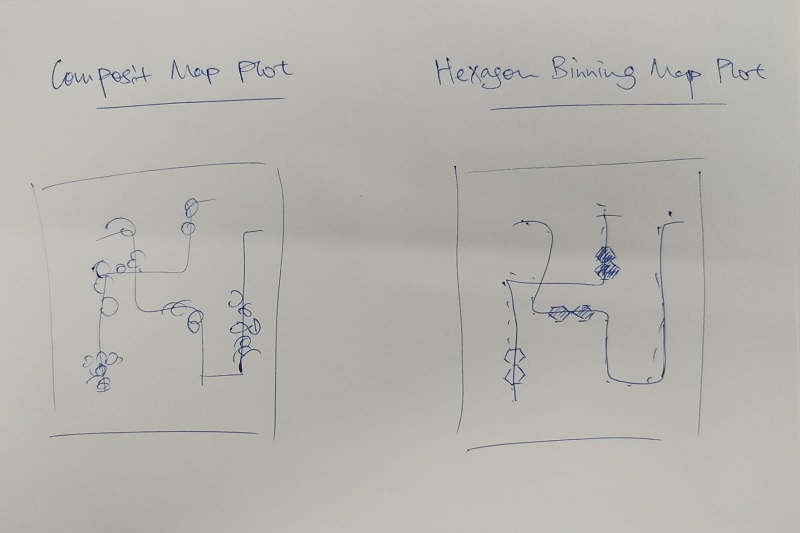

```{r setup, include=FALSE}
knitr::opts_chunk$set(echo = TRUE,
                      eval = TRUE,
                      warning = FALSE,
                      message = FALSE,
                      fig.retina = 3)
```


# Task

**Challenge 2: Patterns of Life** considers the patterns of daily life throughout the city. You will describe the daily routines for some representative people, characterize the travel patterns to identify potential bottlenecks or hazards, and examine how these patterns change over time and seasons.

In Challenge 2, you will use visual analytic techniques to address these questions:

- Assuming the volunteers are representative of the city’s population, characterize the distinct areas of the city that you identify. For each area you identify, provide your rationale and supporting data. Limit your response to 10 images and 500 words.

- Where are the busiest areas in Engagement? Are there traffic bottlenecks that should be addressed? Explain your rationale. Limit your response to 10 images and 500 words.

# Overview

In this take-home exercise, appropriate visual analytics methods are used to reveal the social areas as well as the locations with traffic bottleneck of the [city of Engagement, Ohio USA](https://vast-challenge.github.io/2022/) while addressing the questions stated in the Task section.

The data are processed by using appropriate **tidyverse** family of packages.

# Sketch of Proposed Design

The picture below shows a sketch of the initial design proposed. 




# Installing & Launching R Packages

Before we get started, it is important for us to ensure that the required R packages have been installed. If yes, we will load the R packages. If they have yet to be installed, we will install the R packages and load them onto R environment.

The chunk code below will do the trick.

```{r}
packages = c('sf', 'tmap', 'tidyverse', 'lubridate', 'clock', 'sftime', 'rmarkdown', 'ggiraph', 'plotly', 'DT', 'patchwork','crosstalk')

for(p in packages){
  if(!require(p, character.only = T)){
    install.packages(p)
  }
  library(p, character.only = T)
}

```

# Importing Data

In the code chunk below, [`read_sf()`](https://r-spatial.github.io/sf/reference/st_read.html) of [**sf**](https://r-spatial.github.io/sf/) package is used to parse *School.csv*, *Pubs.csv*, *Apartments.csv*, *Buildings.csv*, *Employer.csv*, and *Restaurants.csv* from the data folder into R as sf data.frames. The 6 files parsed represented the various social areas we would like to explore.

```{r}
schools <- read_sf("data/wkt/Schools.csv", 
                   options = "GEOM_POSSIBLE_NAMES=location")  
pubs <- read_sf("data/wkt/Pubs.csv", 
                   options = "GEOM_POSSIBLE_NAMES=location")
apartments <- read_sf("data/wkt/Apartments.csv", 
                   options = "GEOM_POSSIBLE_NAMES=location")
buildings <- read_sf("data/wkt/Buildings.csv", 
                   options = "GEOM_POSSIBLE_NAMES=location")
employers <- read_sf("data/wkt/Employers.csv", 
                   options = "GEOM_POSSIBLE_NAMES=location")
restaurants <- read_sf("data/wkt/Restaurants.csv", 
                   options = "GEOM_POSSIBLE_NAMES=location")

print(buildings)
print(restaurants)
```

# Plot Building Footprint Map

The code chunk below plots the building polygon features by using [`tm_polygon()`](https://rdrr.io/cran/tmap/man/tm_polygons.html) of **tmap**.

```{r}
tmap_mode("view")
tm_shape(buildings) +
tm_polygons(col = "grey60",
           size = 1,
           border.col = "black",
           border.lwd = 1) +
tm_layout(title= "Building Footprint Map of the City of Engagement")
tmap_mode("plot")
```


# Plotting A Composite Map

The code chunk below is used to plot a composite map by combining the simple feature data.frames of the buildings and the various social areas.

```{r}
tmap_mode("view") +
tm_shape(buildings)+
tm_polygons(col = "grey60",
           size = 1,
           border.col = "black",
           border.lwd = 1) +
tm_shape(employers) +
  tm_dots(col = "red") +
tm_shape(apartments) +
  tm_dots(col = "lightblue") +
tm_shape(pubs) +
  tm_dots(col = "green") +
tm_shape(restaurants) +
  tm_dots(col = "blue") +
tm_shape(schools) +
  tm_dots(col = "yellow") +
tm_layout(title= "Composite Map of Social Areas of the City of Engagement")
tmap_mode("plot")
```

We arrive at the following points regarding social areas of the city:

**Central Region**: Central business district of the city, with greatest number of companies/restaurants/pubs located in the center of this region. The inner region is surrounded by residential apartments.

**North-West Region**: Mature estate with densely populated apartments as well as its own list of companies. Reasonably numbers of restaurants, pubs and schools are also seen in this region.

**South Region** & **East Region**: Non-mature estates with relatively less apartments and companies. The number of restaurants, pubs and schools are proportionally less too.


# Importing Data

In the code chunk below, [`read_sf()`](https://r-spatial.github.io/sf/reference/st_read.html) of [**sf**](https://r-spatial.github.io/sf/) package is used to parse *ParticipantStatusLogs1.csv* from the rawdata folder into R as a simple feature data.frame.

```{r eval=FALSE}
logs <- read_sf("rawdata/ActivityLogs/ParticipantStatusLogs1.csv", 
                options = "GEOM_POSSIBLE_NAMES=currentLocation")
```


# Data Wrangling

```{r eval=FALSE}
logs_selected <- logs %>%
  mutate(Timestamp = date_time_parse(timestamp,
                zone = "",
                format = "%Y-%m-%dT%H:%M:%S")) %>%
  mutate(day = get_day(Timestamp)) %>%
  filter(currentMode == "Transport")
```

Data frame *logs_selected* is saved in RDS format to avoid uploading large files to Git.

```{r eval=FALSE}
saveRDS(logs_selected, 'data/logs_selected')
```

```{r}
logs_selected <- readRDS('data/logs_selected')
```


# Plotting Hexagon Binning Map

In the code chunk below, `st_make_grid()` of **sf** package is used to create hexagons.

```{r}
hex <- st_make_grid(buildings, 
                    cellsize=100, 
                    square=FALSE) %>%
  st_sf() %>%
  rowid_to_column('hex_id')
plot(hex)
```

The code chunk below perform point in polygon overlay by using `st_join()` of **sf** package.

```{r}
points_in_hex <- st_join(logs_selected, 
                         hex, 
                         join=st_within)
plot(points_in_hex, pch='.')
```


In the code chunk below, `st_join()` of **sf** package is used to count the number of event points in the hexagons.

```{r}
points_in_hex <- st_join(logs_selected, 
                        hex, 
                        join=st_within) %>%
  st_set_geometry(NULL) %>%
  count(name='pointCount', hex_id)
head(points_in_hex)
```

In the code chunk below, `left_join()` of **dplyr** package is used to perform a left-join by using *hex* as the target table and *points_in_hex* as the join table. The join ID is hex_id.

```{r}
hex_combined <- hex %>%
  left_join(points_in_hex, 
            by = 'hex_id') %>%
  replace(is.na(.), 0)
```


In the code chunk below, **tmap** package is used to create the hexagon binning map.

```{r fig.width=8, fig.height=10}
tm_shape(hex_combined %>%
           filter(pointCount > 0))+
  tm_fill("pointCount",
          style = "headtails",
          title="Point Count") +
  tm_borders(alpha = 0.1) +
  tm_layout(main.title = "Hexagon Binning Map of the City of Engagement",
    main.title.position = "center",
    main.title.color = "black") +
  tm_scale_bar(text.size = 0.5,
               color.dark = "black",
               color.light = "white",
               lwd = 1) +
  tm_compass(type="radar",
             north = 0,
             text.size = 0.8,
             show.labels = 3,
             cardinal.directions = c("N", "E", "S", "W"),
             lwd = 1,
             position = c("right", "top"))
```

The darker-colored points are the busiest areas in Engagement. 

The possible traffic bottlenecks (as seen in the figure below) are:

- The path joining **Central Region** to **North-West Region**

- The path joining **South Region** to **East Region**

We also notice that these 2 paths are indeed the only paths possible connecting the regions together.


# Interactive Scatterplot

In the code chunk below, `ggplotly()` of **plotly** and `bscols()` of **crosstalk** are used to plot an interactive scatter plot with a table to visualize the number of event points in the hexagons

```{r}
dd <- highlight_key(points_in_hex)

graph1 <- ggplot(dd, aes(x = hex_id, y = pointCount)) +
  geom_point(size=1) +
  theme(axis.title.y= element_text(angle=0), axis.ticks.x= element_blank(), axis.text.x=element_blank(), axis.line= element_line(color= 'grey')) +
  ggtitle("Distribution of Hex Id") +
  xlab("Hex Id") +
  ylab("Point Count")

gg <- highlight(ggplotly(graph1),
                "plotly_selected")

crosstalk::bscols(gg, 
                  widths = c(12,12),
                  DT::datatable(dd,
                                rownames = FALSE,
                                colnames = c('Hex Id' = 'hex_id',
                                             'Point Count' = 'pointCount'), 
                                filter = 'top',
                                class = 'display'))
```

# Plotting Hexagon Binning Map (AM vs PM)

We will now look at the difference in the Hexagon Binning Map of AM vs that of PM.

```{r echo=FALSE}
logs_selected_am <- logs_selected %>%
  mutate(am = am(Timestamp)) %>%
  filter(am == "TRUE")
```

```{r echo=FALSE}
points_in_hex_am <- st_join(logs_selected_am, 
                         hex, 
                         join=st_within)
```

```{r echo=FALSE}
points_in_hex_am <- st_join(logs_selected_am, 
                        hex, 
                        join=st_within) %>%
  st_set_geometry(NULL) %>%
  count(name='pointCount', hex_id)
```

```{r echo=FALSE}
hex_combined_am <- hex %>%
  left_join(points_in_hex_am, 
            by = 'hex_id') %>%
  replace(is.na(.), 0)
```

```{r}
tm_shape(hex_combined_am %>%
           filter(pointCount > 0))+
  tm_fill("pointCount",
          style = "headtails",
          title="Point Count") +
  tm_borders(alpha = 0.1) +
  tm_layout(main.title = "Hexagon Binning Map (AM)",
    main.title.position = "center",
    main.title.color = "black") +
  tm_scale_bar(text.size = 0.5,
               color.dark = "black",
               color.light = "white",
               lwd = 1) +
  tm_compass(type="radar",
             north = 0,
             text.size = 0.8,
             show.labels = 2,
             cardinal.directions = c("N", "E", "S", "W"),
             lwd = 1,
             position = c("right", "top"))
```


```{r echo=FALSE}
logs_selected_pm <- logs_selected %>%
  mutate(am = am(Timestamp)) %>%
  filter(am == "FALSE")
```

```{r echo=FALSE}
points_in_hex_pm <- st_join(logs_selected_pm, 
                         hex, 
                         join=st_within)
```

```{r echo=FALSE}
points_in_hex_pm <- st_join(logs_selected_pm, 
                        hex, 
                        join=st_within) %>%
  st_set_geometry(NULL) %>%
  count(name='pointCount', hex_id)
```

```{r echo=FALSE}
hex_combined_pm <- hex %>%
  left_join(points_in_hex_pm, 
            by = 'hex_id') %>%
  replace(is.na(.), 0)
```

```{r}
tm_shape(hex_combined_pm %>%
           filter(pointCount > 0))+
  tm_fill("pointCount",
          style = "headtails",
          title="Point Count") +
  tm_borders(alpha = 0.1) +
  tm_layout(main.title = "Hexagon Binning Map (PM)",
    main.title.position = "center",
    main.title.color = "black") +
  tm_scale_bar(text.size = 0.5,
               color.dark = "black",
               color.light = "white",
               lwd = 1) +
  tm_compass(type="radar",
             north = 0,
             text.size = 0.8,
             show.labels = 2,
             cardinal.directions = c("N", "E", "S", "W"),
             lwd = 1,
             position = c("right", "top"))
```

From both maps, we can see that the path joining **Central Region** to **North-West Region** is more prominent in AM than in PM. Same pattern is also spotted for the path joining **South Region** to **East Region**. This might be because both paths are the main paths for people to travel to work in the morning, but after work in the evening some people may have gone to other places for dinner or gatherings and returned home using other routes thereafter.


