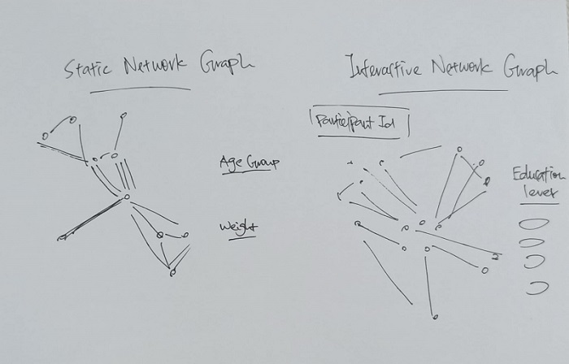
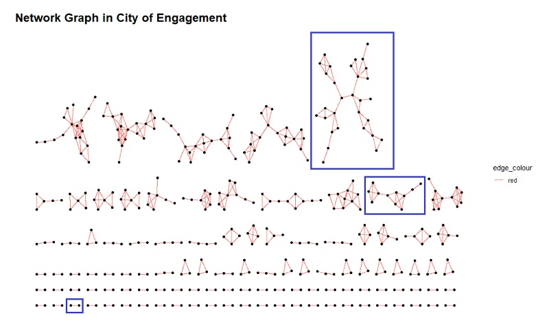

```{r setup, include=FALSE}
knitr::opts_chunk$set(echo = TRUE,
                      eval = TRUE,
                      warning = FALSE,
                      message = FALSE,
                      fig.retina = 3)
```


# Task

**Challenge 1: Demographics and Relationships** involves understanding the city’s demographics. Given social networks and other information about the city, you will analyze the available data to prepare a one-page fact sheet about the city’s demographics, its neighborhoods, and its business base.

In Challenge 1, you will use visual analytic techniques to address the following questions:

- Consider the social activities in the community. What patterns do you see in the social networks in the town? Describe up to ten significant patterns you observe, with evidence and rationale. Limit your response to 10 images and 500 words.

# Overview

In this take-home exercise, social network approach is used to reveal the patterns of community interactions of the [city of Engagement, Ohio USA](https://vast-challenge.github.io/2022/) while addressing the questions stated in the Task section.

The data are processed by using appropriate **tidyverse** family of packages.

# Sketch of Proposed Design

The picture below shows a sketch of the initial design proposed. 




# Installing & Launching R Packages

Before we get started, it is important for us to ensure that the required R packages have been installed. If yes, we will load the R packages. If they have yet to be installed, we will install the R packages and load them onto R environment.

The chunk code below will do the trick.

```{r}
packages = c('igraph', 'tidygraph', 
             'ggraph', 'visNetwork', 
             'lubridate', 'clock',
             'tidyverse', 'ggmap')

for(p in packages){
  if(!require(p, character.only = T)){
    install.packages(p)
  }
  library(p, character.only = T)
}

```

# Importing Data

The code chunk below imports *SocialNetwork.csv* and *Participants.csv* from the rawdata folder into R by using [`read_csv()`](https://readr.tidyverse.org/reference/read_delim.html) of [**readr**](https://readr.tidyverse.org/) package and save them as tibble data frames called *social* and *participants*.

```{r eval=FALSE}
social <- read_csv("rawdata/SocialNetwork.csv")
participants <- read_csv("rawdata/Participants.csv")

glimpse(social)
```

# Data Wrangling

We will add 1 to each Participant Id in *social* and *participants* as vertex id is not allowed to be zero.

```{r eval=FALSE}
participants$participantId = participants$participantId + 1

social$participantIdFrom = social$participantIdFrom + 1
social$participantIdTo = social$participantIdTo + 1
```

We will re-order the fields in *social* data frame such that participantIdFrom & participantIdTo will become the first two columns. Weekday and year_month columns are also added to this data frame.

```{r eval=FALSE}
social <- social %>%
  select(participantIdFrom, participantIdTo, timestamp) %>%
  mutate(weekday = wday(timestamp,
                        label = TRUE,
                        abbr = FALSE))
```

For the ease of visualization, we will aggregate by participantIdFrom, participantIdTo and Weekday using the code chunk below. Weight is set as greater than 55 to ensure a simpler network graph

```{r eval=FALSE}
social_aggregated <- social %>%
  group_by(participantIdFrom, participantIdTo, weekday) %>%
    summarise(weight = n()) %>%
  filter(participantIdFrom != participantIdTo) %>%
  filter(weight > 55) %>%
  ungroup()
```

Data frames *social*, *social_aggregated* and *participants* are saved in RDS format to avoid uploading large files to Git.

```{r eval=FALSE}
saveRDS(social, 'data/social.rds')
saveRDS(social_aggregated, 'data/social_aggregated.rds')
saveRDS(participants, 'data/participants.rds')
```

```{r}
social <- readRDS('data/social.rds')
social_aggregated <- readRDS('data/social_aggregated.rds')
participants <- readRDS('data/participants.rds')
```

The code chunk below helps to ensure the *participants_selected* contains all distinct Participant Ids from the *social_aggregated* data frame.

```{r}
participants_selected <- participants %>%
  filter(participantId %in% social_aggregated$participantIdFrom) %>%
  filter(participantId %in% social_aggregated$participantIdTo)
```

We will also create a age grouping further analysis. As for educationLevel, we need to implement an alternative way of sorting since `as_tbl_graph()` will turn the usual factor way of sorting back to characters data type.

```{r}
participants_selected$age_group <- cut(participants_selected$age,
                                  breaks = c(-Inf,21, 31, 41, 51, Inf),
                                  labels = c("<20", "21-30","31-40", 
                                             "41-50","51-60"),
                                  right = FALSE)

participants_selected$educationLevel <- sub('Low', 'a-Low',participants_selected$educationLevel)
participants_selected$educationLevel <- sub('HighSchoolOrCollege', 'b-HighSchoolOrCollege',participants_selected$educationLevel)
participants_selected$educationLevel <- sub('Bachelors', 'c-Bachelors',participants_selected$educationLevel)
participants_selected$educationLevel <- sub('Graduate', 'd-Graduate',participants_selected$educationLevel)
                                    
                              

# participants_selected$educationLevel = factor(participants_selected$educationLevel,
#                                               levels=c('Low','HighSchoolOrCollege','Bachelors','Graduate'))
```


# Building Tidygraph Data Model

In the code chunk below, `tbl_graph()` of **tinygraph** package is used to build a tidygraph's network graph data.frame.

```{r}
social_graph <- graph_from_data_frame(social_aggregated,
                           vertices = participants_selected) %>%
  as_tbl_graph()

social_graph
```

# Basic Network Graph

The code chunk below uses `ggraph()`, `geom-edge_link()` and `geom_node_point()` to plot a network graph by using *social_graph*.

```{r fig.width=12, fig.height=8}
ggraph(social_graph) +
  geom_edge_link(aes(colour = 'red')) +
  geom_node_point() + 
  labs(title = "Network Graph in City of Engagement") +
  theme_graph()
```

We can see that this give rises to a series of network plots where we can find relatively simple network such as two persons and relatively complex network such as the one on the upper right corner. Our next task is to extract out the the most, moderate and least complex networks and to investigate them in greater detail.

The 3 networks varied in complexity are identified as follows:




# Network Graphs by Different Characteristics

## By Age Group

```{r fig.width=12, fig.height=8}
ggraph(social_graph) + 
  geom_edge_link(aes(width=weight), 
                 alpha=0.05) +
  scale_edge_width(range = c(0.1, 5)) +
  geom_node_point(aes(colour = age_group, 
                      size = 2)) +
  labs(title = "Network Graph by Age Group") +
  theme_graph()
```

## By Interest Group

```{r fig.width=12, fig.height=8}
ggraph(social_graph) + 
  geom_edge_link(aes(width=weight), 
                 alpha=0.05) +
  scale_edge_width(range = c(0.1, 5)) +
  geom_node_point(aes(colour = interestGroup, 
                      size = 2)) +
  labs(title = "Network Graph by Interest Group") +
  theme_graph()
```

## By Household Size

```{r fig.width=12, fig.height=8}
ggraph(social_graph) + 
  geom_edge_link(aes(width=weight), 
                 alpha=0.05) +
  scale_edge_width(range = c(0.1, 5)) +
  geom_node_point(aes(colour = as.factor(householdSize), 
                      size = 2)) +
  labs(title = "Network Graph by Household Size") +
  theme_graph()
```

## By Education Level

```{r fig.width=12,fig.height=8}
ggraph(social_graph) + 
  geom_edge_link(aes(width=weight), 
                 alpha=0.05) +
  scale_edge_width(range = c(0.1, 5)) +
  geom_node_point(aes(colour = educationLevel, 
                      size = 2)) +
  labs(title = "Network Graph by Education Level") +
  theme_graph()
```

The possible explanations for the most, moderate and least complex networks identified are:

- **Most Complex Network** with 30 Nodes

This network seems to represent a company with possibly 5 departments (represented by 5 inner networks with greater weight). Most departments have a good spread of the age distribution with some youths and senior leaders. Within each inner networks, they have very different interest groups, which might be true in a company set-up. There is also at least 1 Bachelor/Graduate in each inner network, which may also coincides with the company structure. 

- **Moderate Complex Network** with 11 Nodes

This network seems to represent a group of friends which predominantly are made up of High School/College education levels and have similar interest in interest group D & G. This group seems to also have 2 inner networks. The network on the left represent those who are more junior in age and are mostly single. The network on the right represent those who are more senior and are having bigger household size.

- **Least Complex Network** with 2 Nodes

This network seems to represent 2 siblings who have the same interest and household size. Their difference in education level can be explained by the difference in age.


# Framed Facet Network Graph

In the code chunk below, `facet_nodes()` of **ggraph** is used to plot a framed facet network graph.

```{r fig.width=12,fig.height=10}
set_graph_style()
ggraph(social_graph) + 
  geom_edge_link(aes(width=weight), 
                 alpha=0.05) +
  scale_edge_width(range = c(0.1, 5)) +
  geom_node_point(aes(colour = educationLevel), 
                  size = 2) + 
  facet_nodes(~educationLevel)+
  th_foreground(foreground = "grey80",  
                border = TRUE) +
  theme(legend.position = 'bottom')
```

We can see that there are a greater level of connection among participants of HighSchoolOrCollege / Bachelor levels. There is limited connection among participants of Graduate level while there is almost no connection among those with Low education level.

# Interactive Network Graph

In the code chunk below, some data wrangling are used to prepare the data for **visNetwork**, and `visOptions()` is used to incorporate interactivity features in the network graph.

```{r}
social_edges_aggregated <- social %>%
  left_join(participants_selected, by = c("participantIdFrom" = "participantId")) %>%
  rename(from = participantIdFrom) %>%
  left_join(participants_selected, by = c("participantIdTo" = "participantId")) %>%
  rename(to = participantIdTo) %>%
  group_by(from, to) %>%
    summarise(weight = n()) %>%
  filter(from!=to) %>%
  filter(weight > 50) %>%
  ungroup()
```

```{r echo=FALSE}
participants_selected_int <- participants_selected %>%
  filter(participantId %in% social_edges_aggregated$from) %>%
  filter(participantId %in% social_edges_aggregated$to)
```

```{r}
participants_selected_int <- participants_selected_int %>%
  rename(group = educationLevel, id = participantId)
```

```{r}
visNetwork(participants_selected_int,
           social_edges_aggregated) %>%
  visIgraphLayout(layout = "layout_with_fr") %>%
  visOptions(highlightNearest = TRUE,
             nodesIdSelection = TRUE) %>%
  visLegend() %>%
  visLayout(randomSeed = 123)
```


